# 👨‍💼 HR Analytics Dashboard

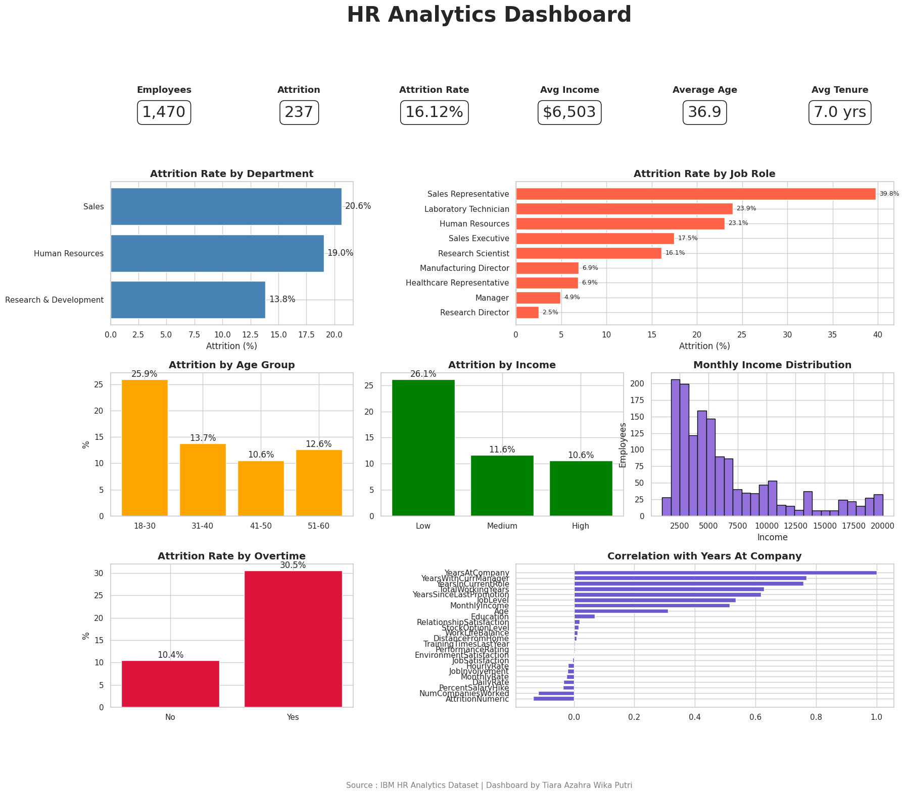

---

## 📌 Project Overview

Employee attrition is one of the biggest challenges faced by Human Resource departments. High turnover increases recruitment costs, reduces productivity, and affects organizational performance.

This project performs an end-to-end HR Analytics workflow using Python, starting from data cleaning, exploratory data analysis (EDA), feature engineering, business insight generation, and executive dashboard development.

The objective is to identify employee characteristics associated with attrition and provide actionable recommendations for HR decision makers.

---

# 📂 Dataset

**Dataset:** IBM HR Analytics Employee Attrition & Performance

- 1,470 Employees
- 34 Variables
- No Missing Values
- No Duplicate Records

Target Variable

- Attrition (Yes / No)

---

# 🛠 Tech Stack

- Python
- Pandas
- NumPy
- Matplotlib
- Google Colab
- GitHub

---

# 📊 Executive Dashboard


---

# 📈 Key Performance Indicators (KPI)

| Metric | Value |
|---------|--------|
| Employees | **1,470** |
| Attrition Employees | **237** |
| Attrition Rate | **16.12%** |
| Retention Rate | **83.88%** |

---

# 📊 Exploratory Data Analysis

## Employee Attrition Distribution

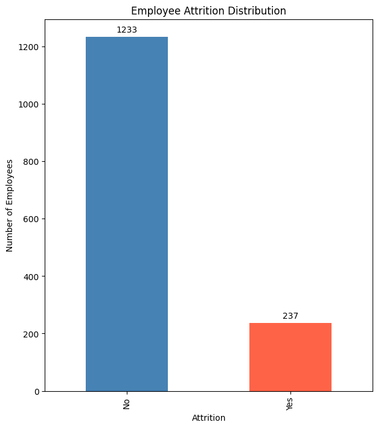

Most employees remain in the company. However, around **16%** have left the organization.

---

## Attrition by Department

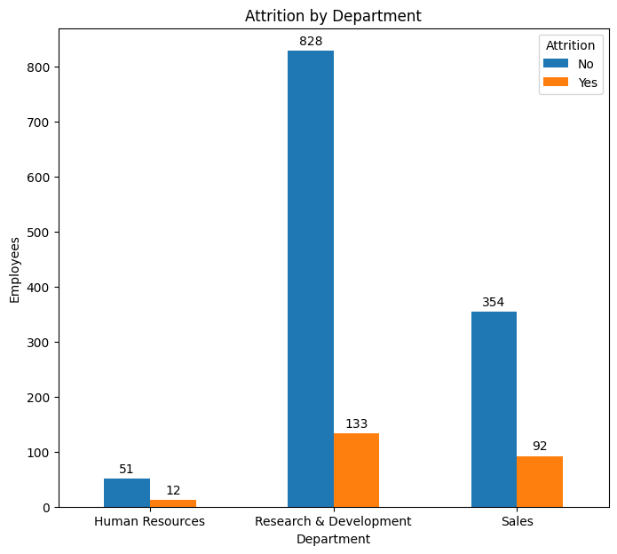

Sales and Human Resources show relatively higher attrition compared to Research & Development.

---

## Attrition by Gender

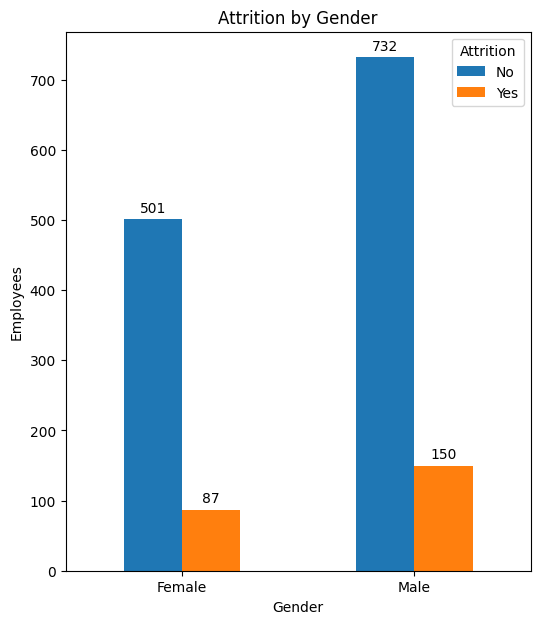

Attrition is relatively balanced between male and female employees, indicating gender is not the primary factor.

---

## Attrition by Overtime

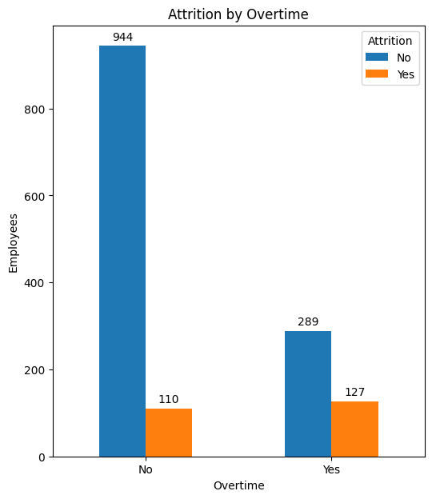

Employees working overtime are significantly more likely to leave the company.

---

## Attrition by Job Role

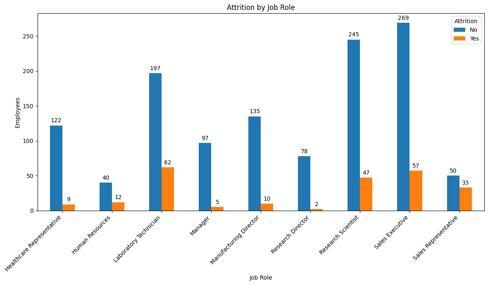

Sales Representatives and Laboratory Technicians experience the highest attrition rates.

---

## Attrition by Age Group

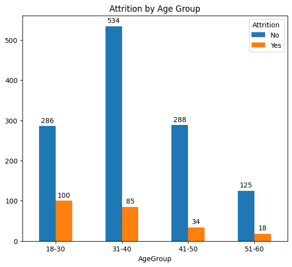

Younger employees (18–30 years) show the highest turnover.

---

## Attrition by Income Level

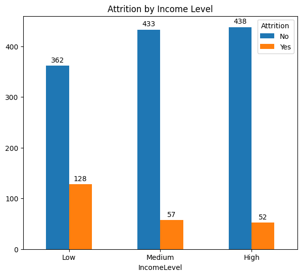

Lower-income employees are considerably more likely to resign.

---

## Attrition by Years at Company

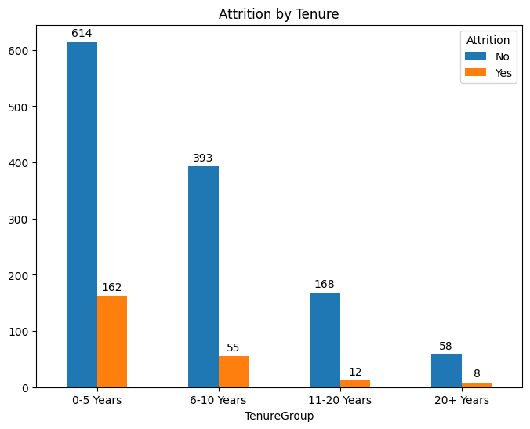

Most resignations occur during the first five years of employment.

---

## Monthly Income Distribution

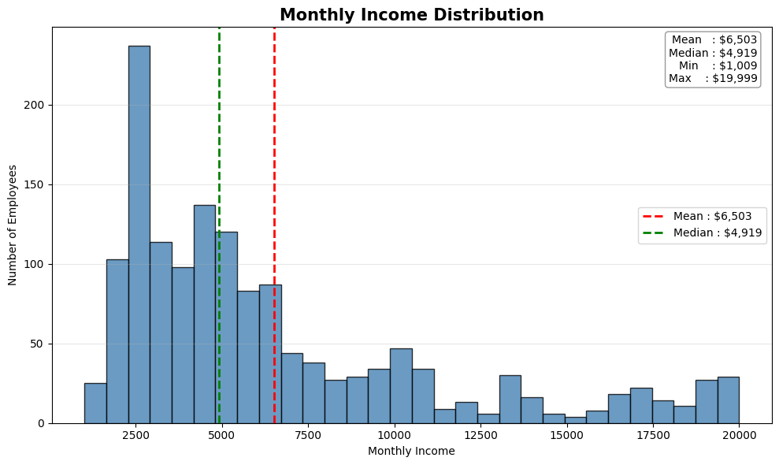

Income distribution is highly right-skewed, with most employees earning lower monthly salaries.

---

## Employee Age Distribution

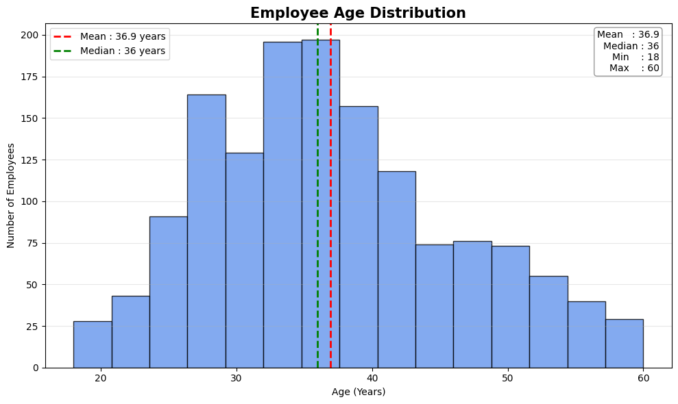

The workforce is dominated by employees aged between 30 and 40 years.

---

## Correlation Heatmap


Most variables exhibit weak linear relationships, suggesting employee attrition is influenced by multiple interacting factors.

---

## Monthly Income Correlation

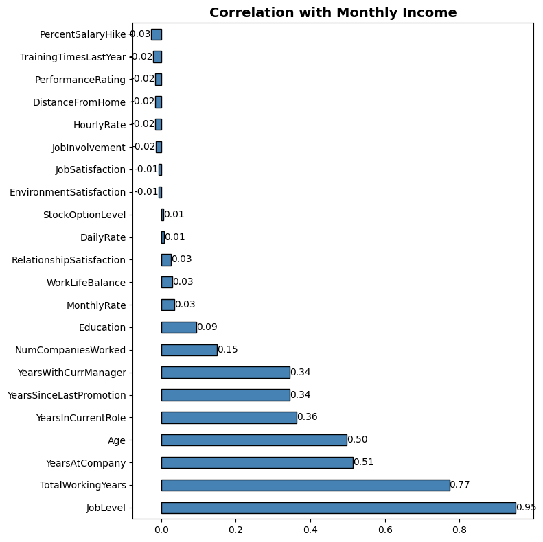

Monthly income strongly correlates with Job Level, Total Working Years, and Years at Company.

---

# 💼 Business Insights

### 1. Overtime is the strongest attrition indicator

Employees working overtime leave at a much higher rate than those without overtime.

**Recommendation**

- Improve workload balancing
- Reduce excessive overtime
- Monitor employee burnout

---

### 2. Early-career employees leave more frequently

Employees within their first five years show the highest turnover.

**Recommendation**

- Strengthen onboarding programs
- Conduct stay interviews
- Improve mentoring initiatives

---

### 3. Lower-income employees are more likely to resign

Employees in the low-income group experience significantly higher attrition.

**Recommendation**

- Review salary competitiveness
- Introduce performance incentives
- Develop clearer career progression

---

### 4. Sales-related roles require attention

Sales Representatives exhibit the highest attrition.

**Recommendation**

- Review sales targets
- Improve commission structure
- Enhance career development opportunities

---

### 5. Attrition is not primarily driven by gender

Gender differences are relatively small compared to factors such as overtime, tenure, and income.

---

# 📋 Executive Summary

This HR Analytics project identified several key factors associated with employee attrition.

The analysis indicates that overtime, tenure, income level, and job role have a stronger relationship with employee turnover than demographic variables such as gender.

The findings suggest HR managers should prioritize workload management, employee retention during early employment, competitive compensation, and targeted interventions for high-risk job roles.

Implementing these recommendations can help reduce turnover and improve workforce stability.

---

# 📁 Project Structure

```
HR-Analytics-Dashboard/
│
├── data/
│   ├── data_IBM.csv
│   └── README.md
│
├── images/
│   ├── HR_Analytics_Dashboard.png
│   ├── Employee_Attrition_Distribution.png
│   ├── Attrition_by_Department.png
│   ├── Attrition_by_Gender.png
│   ├── Attrition_by_Overtime.png
│   ├── Attrition_by_JobRole.png
│   ├── Attrition_by_AgeGroup.png
│   ├── Attrition_by_IncomeLevel.png
│   ├── Attrition_by_YearsatCompany.png
│   ├── Monthly_Income_Distribution.png
│   ├── Age_Distribution.png
│   ├── Correlation_Heatmap.png
│   └── Correlation_with_MonthlyIncome.png
│
├── HR_Analytics.ipynb
├── README.md
└── LICENSE
```

---

# 🚀 Future Improvements

- Predict employee attrition using Machine Learning
- Build an interactive dashboard with Power BI
- Develop predictive HR models using XGBoost
- Perform feature importance analysis using SHAP values
- Deploy the dashboard as a web application

---

## 👩 Author

**Tiara Azahra Wika Putri**

Master of Mathematics

Aspiring Data Analyst

GitHub:
https://github.com/azahratawp-ctrl

LinkedIn:
https://www.linkedin.com/in/tiaraazahrawikap
